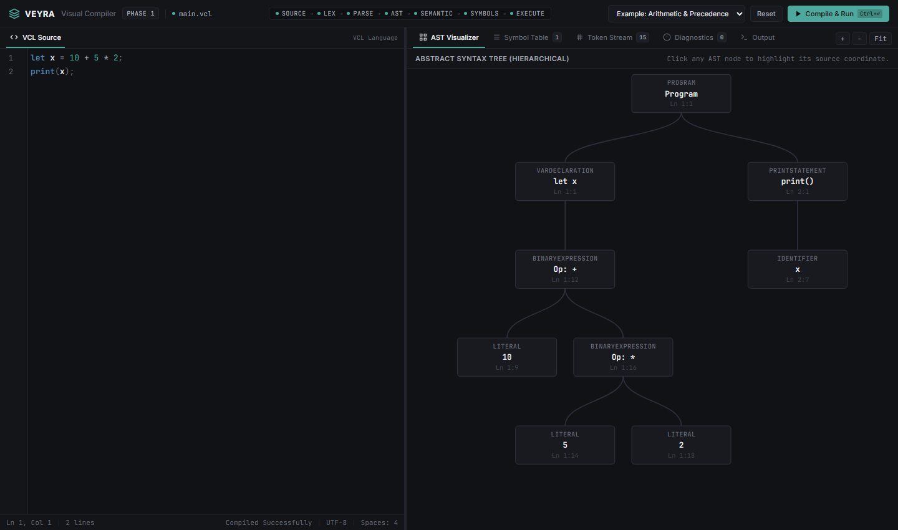
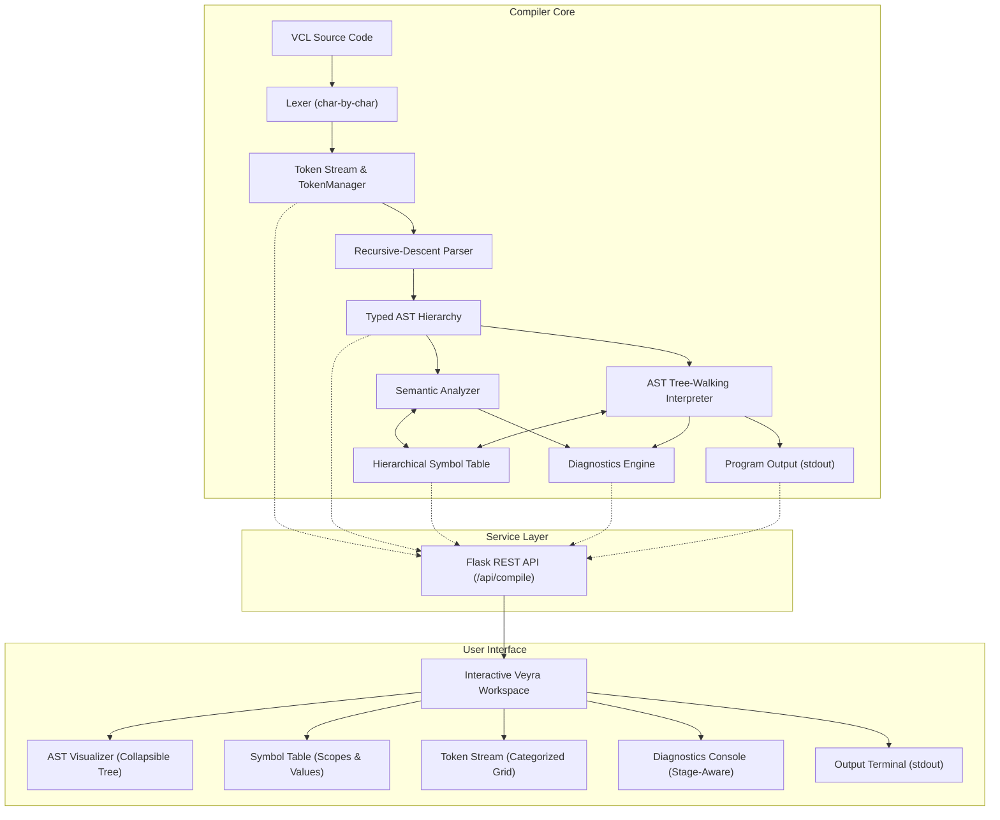
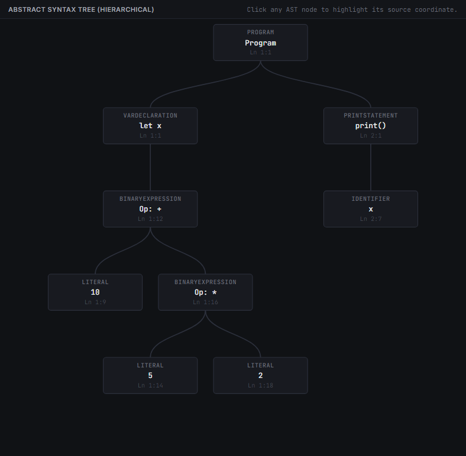
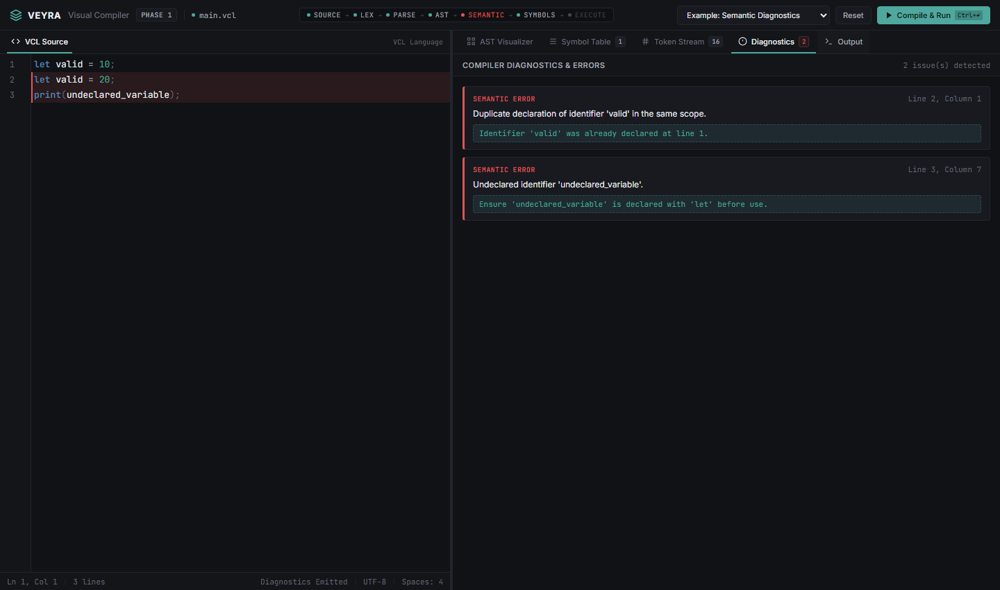

# Veyra Visual Compiler

An interactive compiler engineering environment that makes the language-processing pipeline observable, inspectable, and executable.

<p align="center">
  <strong>VCL</strong> &bull;
  <strong>Interactive Compiler</strong> &bull;
  <strong>AST Visualization</strong> &bull;
  <strong>Symbol Table</strong> &bull;
  <strong>Diagnostics</strong> &bull;
  <strong>Interpreter</strong>
</p>

<p align="center">
  <a href="https://www.python.org/"></a>
  <a href="https://flask.palletsprojects.com/"></a>
  <a href="https://developer.mozilla.org/en-US/docs/Web/JavaScript"></a>
  <a href="tests/"></a>
  <a href="LICENSE"></a>
</p>

---

## Workspace Overview



---

## 1. Project Story & Philosophy

Traditional compilers operate as opaque black boxes:

$$\text{Source Code} \longrightarrow \fbox{Compiler} \longrightarrow \text{Machine Output}$$

For developers, educators, and students investigating language implementations, this black-box paradigm conceals the most critical engineering transformations: how character sequences become structured tokens, how grammar rules assemble an Abstract Syntax Tree (AST), how scopes resolve bindings within a symbol table, and why semantic constraints reject invalid programs before execution.

**Veyra Visual Compiler** is built on a central principle:

> *"Do not hide the compiler pipeline. Make it inspectable."*

Veyra treats compilation as a transparent series of well-defined data transformations:

$$\text{Source} \longrightarrow \text{Tokens} \longrightarrow \text{AST} \longrightarrow \text{Semantic Validation} \longrightarrow \text{Symbol Table} \longrightarrow \text{Interpretation} \longrightarrow \text{Diagnostics} \longrightarrow \text{Output}$$

Veyra is not an input-to-output demonstration tool. It is an interactive compiler engineering environment where every intermediate representation is produced by real compiler algorithms and exposed as structured data for inspection.

---

## 2. Why Veyra?

In conventional computer science curricula and developer exploration:
- **Compiler stages are studied in isolation**: Lexing, parsing, and code generation are often taught as disconnected theory or fragmented homework scripts.
- **Intermediate data structures remain invisible**: Abstract Syntax Trees and Symbol Tables are drawn on whiteboards but rarely inspected interactively against real code.
- **Errors lack stage context**: Standard compiler errors rarely show users *where* in the pipeline validation failed (lexical vs. syntax vs. semantic vs. runtime).
- **Tooling is often synthetic**: Many visual demos use regular expressions or pre-baked syntax trees rather than real recursive-descent parsing and semantic passes.

### The Veyra Response
- **Hand-written character scanner**: Tracks exact line and column numbers character-by-character.
- **Hand-written recursive-descent parser**: Enforces operator precedence and constructs typed AST nodes.
- **Hierarchical Symbol Table**: Multi-scope tracking with parent pointers, types, and evaluated runtime values.
- **Static Semantic Analysis**: Catches undeclared variables, duplicate declarations in the same scope, and type mismatches.
- **Real AST Interpreter**: Evaluates the AST directly (not raw source text), updates runtime symbols, and captures stdout.
- **Structured Diagnostics**: Replaces raw stack traces with stage-aware, location-mapped diagnostic cards.
- **Decoupled REST API**: The Flask backend exposes real compiler outputs to any client or visualization frontend.

---

## 3. What Makes Veyra Different?

Veyra differentiates itself through its **architectural rigor and transparency**. It avoids mock visualizations and provides a real compiler pipeline for a custom language (**VCL — Visual Compiler Language**).

### Design Positioning

| Dimension | Typical Educational Visualizers | Veyra Visual Compiler |
| :--- | :--- | :--- |
| **Primary Focus** | Animation of syntax rules or toy demos | Inspectable compiler engineering environment |
| **Pipeline Visibility** | Single stage or final output | End-to-end: Lexer $\to$ Parser $\to$ AST $\to$ Semantics $\to$ Symbols $\to$ Interpreter |
| **Language Target** | Hardcoded snippets or subsets of C/Python | Custom formally-specified language (**VCL**) |
| **Token Inspection** | Static token lists or text dumps | Interactive categorized stream with positions and metadata |
| **AST Inspection** | Static diagrams or stringified trees | Interactive, collapsible hierarchical tree with source locations |
| **Symbol Table** | Often omitted or simulated | Live scope-aware table tracking name, type, value, and scope level |
| **Diagnostics** | Generic console errors or raw stack traces | Structured stage-attributed diagnostics (Lexical / Syntax / Semantic / Runtime) |
| **Interpreter** | Often missing (parser-only) | Full tree-walking AST interpreter with stdout capture |
| **API Architecture** | Monolithic or client-side only | Decoupled Flask REST API with structured JSON contracts |
| **Automated Testing** | Minimal or manual testing | 38 automated unit & integration tests (`pytest`) |
| **Extensibility** | Fixed demonstration scope | Tiered roadmap toward IR (Three-Address Code), CFG, and step-debugging |

---

## 4. Veyra Design Philosophy

### 1. Transparency over Black Boxes
Every intermediate compiler artifact—from the token stream to the symbol table—should be observable as first-class structured data.

### 2. Real Compiler Logic over Simulated Demos
Visualization is driven by real scanner, parser, semantic, and interpreter outputs. No hardcoded or simulated trees.

### 3. Correctness before Complexity
A complete, correct, and robust compiler for an established language subset is far more valuable than an incomplete or buggy implementation of a large grammar.

### 4. Modular by Design
Each compiler phase has a single responsibility and clean boundaries: `lexer.py`, `parser.py`, `ast_nodes.py`, `symbol_table.py`, `semantic.py`, `interpreter.py`, `errors.py`.

### 5. Diagnostics are First-Class Data
Errors are structured data carrying stage, message, severity, line, column, and actionable context—never raw unhandled Python exceptions.

### 6. Educational without being Toy-Level
While approachable in visual presentation, the internal compiler architecture adheres to production-grade software engineering and compiler design practices.

### 7. Built for Extension
Phase 1 establishes the foundational vertical slice, designed specifically to scale toward intermediate representation (IR), Control Flow Graphs (CFG), and step-by-step execution debugging in subsequent phases.

---

## 5. Current Phase 1 Status

The repository currently implements **Phase 1** (~35% of the total system roadmap). Every implemented component is fully functional, integrated end-to-end, and verified through automated tests.

| Component | Stage / File | Status | Description |
| :--- | :--- | :--- | :--- |
| **Token System** | `backend/tokens.py` | **Implemented** | `TokenType` enum, `Token` dataclass, and `TokenManager` |
| **Lexer** | `backend/lexer.py` | **Implemented** | Char-by-char scanner, line/col tracking, lexical error reporting |
| **Recursive Parser** | `backend/parser.py` | **Implemented** | Hand-written recursive descent with operator precedence climbing |
| **Typed AST** | `backend/ast_nodes.py`| **Implemented** | 10 typed AST classes with visitor pattern and `to_dict()` tree serialization |
| **Symbol Table** | `backend/symbol_table.py` | **Implemented** | Hierarchical multi-scope symbol manager with parent pointers |
| **Semantic Analysis** | `backend/semantic.py` | **Implemented** | Scope-aware identifier validation, duplicate detection, type checks |
| **AST Interpreter** | `backend/interpreter.py` | **Implemented** | Direct AST tree-walker, runtime scope environment, stdout buffering |
| **Diagnostics Model**| `backend/errors.py` | **Implemented** | Structured errors (`Lexical`, `Syntax`, `Semantic`, `Runtime`) with coordinates |
| **Compiler Driver** | `backend/compiler.py` | **Implemented** | Unified pipeline orchestrator returning complete JSON execution bundle |
| **REST API** | `app.py` | **Implemented** | Flask endpoints (`/api/compile`, `/api/examples`, `/api/health`) |
| **Interactive UI** | `frontend/` | **Implemented** | Dark developer IDE, AST tree viewer, symbol table, token stream, console |
| **Automated Tests** | `tests/` | **Implemented** | **38 of 38 tests passing** across all modules |
| **Example Programs**| `examples/` | **Implemented** | 4 curated educational programs (`.vcl`) |

---

## 6. Phase 1 Architecture



---

## 7. VCL Language Specification (Source of Truth)

Veyra compiles the custom **VCL** (*Visual Compiler Language*), adhering strictly to the formal specification:

### Keywords
```vcl
let    if    else    print    true    false
```

### Arithmetic Operators
```vcl
+      -     *       /        %
```

### Relational Operators
```vcl
==     !=    <       >        <=      >=
```

### Logical Operators
```vcl
&&     ||    !
```

### Assignment & Delimiters
```vcl
=      (     )       {        }       ;       ,
```

### Literals & Identifiers
- **Integer**: Digits `[0-9]+`
- **Float**: Decimals `[0-9]+\.[0-9]+`
- **Boolean**: `true` or `false`
- **Identifier**: `[A-Za-z_][A-Za-z0-9_]*`

### Canonical Example (`examples/arithmetic.vcl`)
```vcl
let x = 10 + 5 * 2;
print(x);
```
**Evaluation**:
1. Multiplicative `*` binds tighter than additive `+` $\to 10 + (5 \times 2) = 20$.
2. Symbol Table records: `x` $\to$ type `int`, value `20`, scope `global`.
3. Execution output: `20`.

---

## 8. Compiler Pipeline Breakdown

```
Source ──▶ Lexer ──▶ Parser ──▶ AST ──▶ Semantics ──▶ Symbols ──▶ Interpreter ──▶ Output
```

1. **Lexer (`backend/lexer.py`)**:
   Reads raw character sequences and produces structured tokens while tracking exact line and column numbers. Rejects invalid characters and malformed numeric literals with helpful diagnostics.
2. **Token Manager (`backend/tokens.py`)**:
   Categorizes tokens (Keyword, Identifier, Literal, Operator, Delimiter) and serializes them with source coordinates for visual inspection.
3. **Parser (`backend/parser.py`)**:
   Implements hand-written recursive descent. Enforces grammatical rules and operator precedence climbing (`||` down to primary), constructing an unambiguous syntax tree.
4. **Abstract Syntax Tree (`backend/ast_nodes.py`)**:
   Represents code structure independently of syntactic trivia. Each node stores source locations and provides recursive serialization for hierarchical tree rendering.
5. **Semantic Analyzer (`backend/semantic.py`)**:
   Traverses the AST to validate semantic constraints: ensures identifiers are declared before reference, flags duplicate declarations in the same scope, and checks type compatibility.
6. **Symbol Table (`backend/symbol_table.py`)**:
   Maintains a stack of lexical scopes via parent pointers. Associates variable names with inferred types, scope levels, and evaluated runtime values.
7. **Interpreter (`backend/interpreter.py`)**:
   A tree-walking evaluator that executes AST nodes directly. Handles arithmetic, logical evaluation, conditional branching, variable reassignments, and captures `print(...)` output.
8. **Diagnostics (`backend/errors.py`)**:
   Collects and formats errors across all stages into structured diagnostics containing stage identification, message, line, column, severity, and actionable remediation hints.
9. **Visualization (`frontend/app.js`)**:
   Renders backend compiler data into an interactive IDE interface featuring collapsible AST branches, real-time symbol tables, and terminal outputs.

---

## 9. Visual Inspection in Action

### Interactive AST Visualizer
Collapsible, color-coded AST node hierarchy showing exact operator bindings, statement structures, and source locations:



### Diagnostics Console & Stage Tracking
Stage-aware diagnostics highlighting exact source coordinates, severity badges, and helpful guidance (e.g., catching division by zero):



---

## 10. Technical Highlights

- **Zero Third-Party Parser Generators**: Pure hand-written lexical analysis and recursive-descent parsing for transparent internal control.
- **Precedence Climbing Architecture**: Correctly models mathematical and logical precedence levels (`||` $\to$ `&&` $\to$ equality $\to$ relational $\to$ additive $\to$ multiplicative $\to$ unary $\to$ primary).
- **Hierarchical Scope Tree**: Nested lexical scopes implemented via parent pointers, supporting block scopes and variable shadowing.
- **AST Visitor Pattern**: Decouples AST node data structures from semantic analysis, execution, and serialization algorithms.
- **No Stack Traces Leaked**: Clean exception hierarchy (`VeyraCompilerException`) guarantees user-facing error clarity.
- **Decoupled Client-Server Contract**: Clean JSON REST API separates compiler computation from visualization logic.

---

## 11. Diagnostic Error Model

All compiler errors are structured instances of `Diagnostic`:

```json
{
  "stage": "Syntax Error",
  "severity": "ERROR",
  "message": "Expected ';' after declaration of 'x'.",
  "line": 1,
  "column": 19,
  "hint": "VCL requires semicolons at the end of declarations.",
  "formatted": "[Syntax Error] Expected ';' after declaration of 'x'.\n  --> Line 1, Column 19\n  Hint: VCL requires semicolons at the end of declarations."
}
```

### Supported Diagnostic Stages
- **`Lexical Error`**: Unrecognized characters, single `&`/`|` logical operators, malformed floating-point literals.
- **`Syntax Error`**: Missing semicolons, unmatched parentheses/braces, malformed expressions, unexpected tokens.
- **`Semantic Error`**: Undeclared identifiers, duplicate declarations in the same scope, type mismatches (e.g. arithmetic on boolean).
- **`Runtime Error`**: Division by zero, modulo by zero, uninitialized variable access.

---

## 12. Automated Testing

Veyra enforces rigorous test coverage across all compilation stages.

```bash
python -m pytest tests/ -v
```

### Verified Test Results
```
============================= test session starts =============================
platform win32 -- Python 3.12.5, pytest-8.3.5, pluggy-1.6.0
rootdir: C:\Users\PRANAY KUMAR\OneDrive\Desktop\veyra-visual-compiler
collected 38 items

tests/test_lexer.py::test_tokenize_keywords PASSED                       [  2%]
tests/test_lexer.py::test_tokenize_identifiers_and_literals PASSED       [  5%]
tests/test_lexer.py::test_tokenize_all_operators PASSED                  [  7%]
tests/test_lexer.py::test_tokenize_delimiters PASSED                     [ 10%]
tests/test_lexer.py::test_line_and_column_tracking PASSED                [ 13%]
tests/test_lexer.py::test_lexical_error_invalid_character PASSED         [ 15%]
tests/test_lexer.py::test_lexical_error_single_ampersand PASSED          [ 18%]
tests/test_lexer.py::test_lexical_error_single_pipe PASSED               [ 21%]
tests/test_lexer.py::test_lexical_error_multiple_decimals PASSED         [ 23%]
tests/test_parser.py::test_parse_sample_program PASSED                   [ 26%]
tests/test_parser.py::test_parenthesized_expression_precedence PASSED    [ 28%]
tests/test_parser.py::test_relational_and_logical_precedence PASSED      [ 31%]
tests/test_parser.py::test_assignment_statement PASSED                   [ 34%]
tests/test_parser.py::test_if_else_statement PASSED                      [ 36%]
tests/test_parser.py::test_syntax_error_missing_semicolon PASSED         [ 39%]
tests/test_parser.py::test_syntax_error_missing_initializer PASSED       [ 42%]
tests/test_parser.py::test_syntax_error_unclosed_parenthesis PASSED      [ 44%]
tests/test_semantic.py::test_valid_declarations_and_symbols PASSED       [ 47%]
tests/test_semantic.py::test_undeclared_identifier_in_expression PASSED  [ 50%]
tests/test_semantic.py::test_assignment_to_undeclared_variable PASSED    [ 52%]
tests/test_semantic.py::test_duplicate_declaration_in_same_scope PASSED  [ 55%]
tests/test_semantic.py::test_arithmetic_on_boolean_error PASSED          [ 57%]
tests/test_semantic.py::test_if_condition_non_boolean PASSED             [ 60%]
tests/test_semantic.py::test_block_scope_variable_isolation PASSED       [ 63%]
tests/test_interpreter.py::test_eval_sample_program_returns_twenty PASSED [ 65%]
tests/test_interpreter.py::test_eval_parenthesized_precedence PASSED     [ 68%]
tests/test_interpreter.py::test_eval_float_arithmetic PASSED             [ 71%]
tests/test_interpreter.py::test_eval_assignment_mutation PASSED          [ 73%]
tests/test_interpreter.py::test_eval_if_else_branching PASSED            [ 76%]
tests/test_interpreter.py::test_eval_boolean_logic PASSED                [ 78%]
tests/test_interpreter.py::test_runtime_error_division_by_zero PASSED    [ 81%]
tests/test_interpreter.py::test_runtime_error_modulo_by_zero PASSED      [ 84%]
tests/test_integration.py::test_end_to_end_sample_program PASSED         [ 86%]
tests/test_integration.py::test_end_to_end_lexical_error PASSED          [ 89%]
tests/test_integration.py::test_end_to_end_syntax_error PASSED           [ 92%]
tests/test_integration.py::test_end_to_end_semantic_error PASSED         [ 94%]
tests/test_integration.py::test_end_to_end_runtime_error PASSED          [ 97%]
tests/test_integration.py::test_end_to_end_nested_scope_and_conditionals PASSED [100%]

============================== 38 passed in 0.26s ==============================
```

---

## 13. Curated Example Programs

The repository includes curated VCL programs in `examples/`:

- **[`arithmetic.vcl`](examples/arithmetic.vcl)**: Demonstrates arithmetic operator precedence ($10 + 5 \times 2 = 20$).
  *Learning Outcome*: Visualizes how the parser groups higher-precedence operations deeper in the AST.
- **[`conditions.vcl`](examples/conditions.vcl)**: Demonstrates relational comparison and `if`/`else` control branching.
  *Learning Outcome*: Shows condition branch evaluation and conditional execution.
- **[`scope.vcl`](examples/scope.vcl)**: Demonstrates block scoping (`{ ... }`) and variable mutation.
  *Learning Outcome*: Observes local scope creation, symbol isolation, and parent scope lookups.
- **[`errors.vcl`](examples/errors.vcl)**: Demonstrates semantic validation errors (duplicate variable declaration and undeclared identifier access).
  *Learning Outcome*: Demonstrates how static analysis halts execution and reports source coordinates before runtime.

---

## 14. Installation & Setup

### Prerequisites
- Python 3.10 or higher (Python 3.12 recommended)
- `pip` package manager

### 1. Clone & Navigate
```bash
git clone https://github.com/Pranay-Kumar-02/veyra-visual-compiler.git
cd veyra-visual-compiler
```

### 2. Create and Activate Virtual Environment
**Windows (PowerShell):**
```powershell
python -m venv .venv
.venv\Scripts\Activate.ps1
```

**Windows (Command Prompt):**
```cmd
python -m venv .venv
.venv\Scripts\activate.bat
```

**Linux / macOS:**
```bash
python3 -m venv .venv
source .venv/bin/activate
```

### 3. Install Dependencies
```bash
pip install -r requirements.txt
```

### 4. Run Tests
```bash
python -m pytest tests/ -v
```

### 5. Launch the Veyra Web Workspace
```bash
python app.py
```
Open your browser and navigate to:
```
http://127.0.0.1:5000
```

---

## 15. Repository Structure

```
veyra-visual-compiler/
├── backend/                  # Core compiler pipeline
│   ├── __init__.py           # Package exports
│   ├── tokens.py             # TokenType, Token dataclass, TokenManager
│   ├── errors.py             # Diagnostic model & compiler exceptions
│   ├── lexer.py              # Hand-written character scanner
│   ├── ast_nodes.py          # Typed AST node classes & serializers
│   ├── parser.py             # Recursive-descent hand-written parser
│   ├── symbol_table.py       # Hierarchical scope & symbol tracking
│   ├── semantic.py           # Static semantic validation & type analysis
│   ├── interpreter.py        # Tree-walking AST evaluator
│   └── compiler.py           # Unified pipeline driver & JSON bundler
│
├── frontend/                 # Interactive web workspace (Vanilla JS & CSS)
│   ├── index.html            # Main UI workspace layout
│   ├── style.css             # Modern dark IDE styling & tree theme
│   └── app.js                # Dynamic AST renderer & API client
│
├── examples/                 # Curated educational VCL source files
│   ├── arithmetic.vcl        # Baseline precedence demonstration
│   ├── conditions.vcl        # If-else branching demonstration
│   ├── scope.vcl             # Block scoping & mutations
│   └── errors.vcl            # Semantic diagnostics demonstration
│
├── tests/                    # Automated test suite (pytest)
│   ├── __init__.py
│   ├── test_lexer.py         # Lexer unit tests (9 tests)
│   ├── test_parser.py        # Parser & precedence unit tests (8 tests)
│   ├── test_semantic.py      # Semantic analysis unit tests (7 tests)
│   ├── test_interpreter.py   # AST interpreter unit tests (8 tests)
│   └── test_integration.py   # Full pipeline integration tests (6 tests)
│
├── docs/                     # Documentation assets
│   └── assets/               # Verified UI screenshots
│
├── app.py                    # Flask server & REST API driver
├── requirements.txt          # Minimal Python dependencies
├── .gitignore                # Git ignore configuration
├── LICENSE                   # MIT Open-Source License
├── CONTRIBUTING.md           # Contributor guidelines
├── CODE_OF_CONDUCT.md        # Community code of conduct
├── SECURITY.md               # Vulnerability reporting policy
└── README.md                 # Project documentation
```

---

## 16. Development Roadmap

```
Phase 1: FOUNDATION [COMPLETED]
├── Real Lexer, Parser, AST, Symbols, Interpreter
├── REST API + Interactive IDE Workspace
└── 38 Automated Tests

Phase 2: DEPTH [PLANNED]
├── Language Coverage: Loops ('while', 'for') & Functions
├── Call Stack & Frame Visualization
└── Step-by-Step Execution Tracing

Phase 3: ADVANCED SYSTEMS [ROADMAP]
├── Intermediate Representation (Three-Address Code / 3AC)
├── Control Flow Graph (CFG) Visualizer
└── Optimization Passes (Constant Folding, Dead Code)
```

### Phase 1 — Foundation (Current)
- [x] Character-by-character scanner with line/column tracking
- [x] Hand-written recursive-descent parser with full operator precedence
- [x] Typed AST node hierarchy with visualizer serialization
- [x] Hierarchical symbol table with parent-pointer scopes
- [x] Static semantic validation (undeclared, duplicates, types)
- [x] Tree-walking AST interpreter with stdout capture
- [x] Structured diagnostics with location-mapping
- [x] Interactive web workspace & REST API
- [x] Comprehensive automated test suite (38 passing tests)

### Phase 2 — Depth (Planned)
- [ ] User-defined functions with parameter bindings and return values
- [ ] Runtime call stack and execution frame visualization
- [ ] Looping constructs (`while`, `for`) with loop condition validation
- [ ] Enhanced error recovery for multi-error diagnostics collection
- [ ] Interactive step-by-step AST execution stepping in the UI

### Phase 3 — Advanced Systems (Roadmap)
- [ ] Intermediate Representation (IR): Linear Three-Address Code (3AC) generation
- [ ] Interactive Control Flow Graph (CFG) visualizer with basic blocks and edges
- [ ] Optimization passes visualizer (constant folding, algebraic simplification, dead code elimination)
- [ ] Bytecode compilation and stack-based virtual machine evaluation

---

## 17. License & Academic Attribution

### License
Veyra Visual Compiler is an open-source project released under the [MIT License](LICENSE).  
Copyright &copy; 2026 Pranay Kumar.

